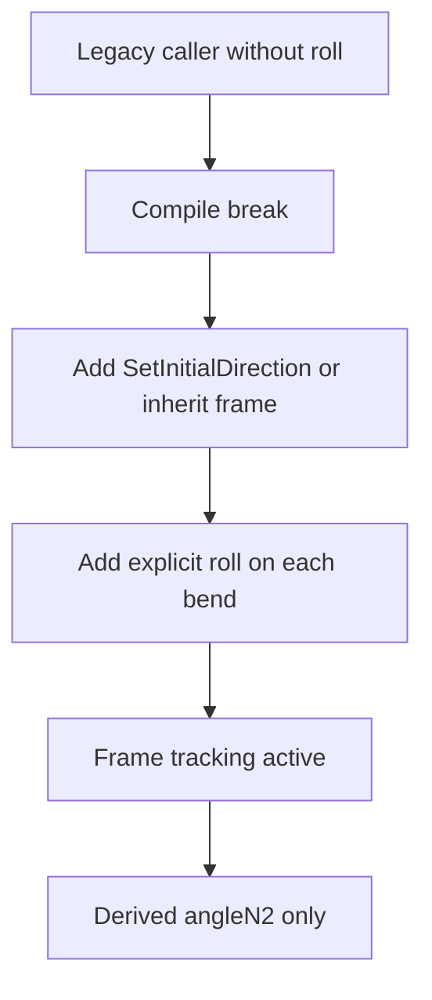

# Review: Direction-change `roll` Migration

## Verdict

The proposal in [`plans/refactor-incr-builder-methods.md`](plans/refactor-incr-builder-methods.md:1) fixes a naming problem, but it does **not** deliver the migration contract you actually want.

It still optimizes for backward compatibility where the requirement is now an **intentional hard break**:

- `roll` stays optional in the public DSL and builder APIs
- EN15544 still accepts the legacy semantic path where DTO `roll` is read back as manual `angleN2`
- callers, tests, and cas types can remain partially migrated and still compile
- missing direction tracking stays quiet instead of becoming visible work

Because of that, I would **not approve** the current plan as written.

## What is worth keeping

A few parts are still directionally correct and should survive into the replacement plan:

- the semantic rename from old manual `angleN2` wording to explicit roll wording in the source API
- the extension of 13384 direction-change APIs so they can participate in frame tracking
- the existing frame-tracking infrastructure already present in [`FlowOnlyIncrementalBuilder_15544.scala`](modules/engine/src/main/scala/afpma/firecalc/engine/impl/en15544/common/FlowOnlyIncrementalBuilder_15544.scala:102) and [`FlowOnlyIncrementalBuilder_15544.updateStateAfterConversionStep()`](modules/engine/src/main/scala/afpma/firecalc/engine/impl/en15544/common/FlowOnlyIncrementalBuilder_15544.scala:192)

The problem is not the geometry/frame machinery. The problem is the compatibility layer built around it.

## The failure signals we actually want

| Situation | Desired signal |
|---|---|
| Source caller omits roll on a direction change | Compile error |
| Pipe contains a direction change but no active local or inherited frame | Validation error |
| Legacy YAML contains only `angle_to_original_direction` and no sound roll information | Migration error or explicit manual-remediation path |

That is the opposite of the current proposal, which keeps the system permissive and silent.

## Review of the existing numbered changes

### 1. [`plans/refactor-incr-builder-methods.md`](plans/refactor-incr-builder-methods.md:61)

**Not approved.**

[`DirectionChangeDSL_13384.scala`](modules/engine/src/main/scala/afpma/firecalc/engine/impl/common/typeclasses/DirectionChangeDSL_13384.scala:13) currently makes roll optional on the core methods and on all convenience helpers in the same trait. That does not force migration. It only adds a new optional feature.

If the goal is to force migration, every direction-change helper must require an explicit roll argument. No default. No `None` path.

### 2. [`plans/refactor-incr-builder-methods.md`](plans/refactor-incr-builder-methods.md:74)

**Partially approved, but the contract is still wrong.**

Renaming the 15544 API from angleN2-oriented wording to roll-oriented wording is correct. But [`DirectionChangeDSL_15544.addSharpAngle_0_to_180deg()`](modules/engine/src/main/scala/afpma/firecalc/engine/impl/common/typeclasses/DirectionChangeDSL_15544.scala:14) still defaults roll to `None`, so the rename does not create a migration boundary.

Before your clarification, a deprecation + replacement-method strategy would have been defensible. After your explicit decision to break now, I do **not** recommend deprecation wrappers or parallel compatibility APIs. Keep the existing names if you want, but make the signatures breaking.

### 3. [`plans/refactor-incr-builder-methods.md`](plans/refactor-incr-builder-methods.md:81)

**Not approved.**

The given instances in [`DirectionChangeDSL_13384_Instances.scala`](modules/engine/src/main/scala/afpma/firecalc/engine/impl/common/instances/DirectionChangeDSL_13384_Instances.scala:17) and [`DirectionChangeDSL_13384_Instances.scala`](modules/engine/src/main/scala/afpma/firecalc/engine/impl/common/instances/DirectionChangeDSL_13384_Instances.scala:59) preserve optional roll and therefore preserve source compatibility.

That is the opposite of the intended migration behavior.

### 4. [`plans/refactor-incr-builder-methods.md`](plans/refactor-incr-builder-methods.md:88)

**Not approved.**

The 15544 given instance in [`DirectionChangeDSL_15544_Instances.scala`](modules/engine/src/main/scala/afpma/firecalc/engine/impl/common/instances/DirectionChangeDSL_15544_Instances.scala:17) should not accept an optional roll either, and [`DirectionChangeDSL_15544_Instances.scala`](modules/engine/src/main/scala/afpma/firecalc/engine/impl/common/instances/DirectionChangeDSL_15544_Instances.scala:29) should not add a new optional arc helper path.

Again: rename is fine, optionality is not.

### 5. [`plans/refactor-incr-builder-methods.md`](plans/refactor-incr-builder-methods.md:97)

**Strongly not approved.**

The fallback in [`ElementFactory_15544_Instances.directionChange15544.make()`](modules/engine/src/main/scala/afpma/firecalc/engine/impl/common/instances/ElementFactory_15544_Instances.scala:118), especially [`computedAngleN2.orElse(legacyAngleN2)`](modules/engine/src/main/scala/afpma/firecalc/engine/impl/common/instances/ElementFactory_15544_Instances.scala:138), formally preserves the wrong data flow:

- DTO `roll` still transports an old manual `angleN2` meaning
- the engine still tolerates callers that never activated frame tracking
- source migration becomes cosmetic rather than semantic

That is the main hack to remove.

The engine model already distinguishes the concepts in [`FlowOnlyPipeDescr_15544.DirectionChange.AngleVifDe0A180()`](modules/engine/src/main/scala/afpma/firecalc/engine/models/en15544/FlowOnlyPipeDescr_15544.scala:122), where `angleN2` is separate from bend angle. The DTO roll slot should therefore stop carrying legacy `angleN2` meaning entirely.

Also, the comment in [`transformers.scala`](modules/dto/src/main/scala/afpma/firecalc/dto/transformers.scala:208) says the legacy field is preserved, while the actual transform at [`transformers.scala`](modules/dto/src/main/scala/afpma/firecalc/dto/transformers.scala:227) drops it. That mismatch is another sign that the migration story is not settled.

### 6-8. [`plans/refactor-incr-builder-methods.md`](plans/refactor-incr-builder-methods.md:116)

**Not approved.**

The public builders are exactly where the hard migration should happen. Keeping optional roll on:

- [`ThermalIncrementalBuilder_13384.addAngleVifDe0A90()`](modules/engine/src/main/scala/afpma/firecalc/engine/impl/en13384/ThermalIncrementalBuilder_13384.scala:408)
- [`FlowOnlyIncrementalBuilder_13384.addAngleVifDe0A90()`](modules/engine/src/main/scala/afpma/firecalc/engine/impl/en13384/FlowOnlyIncrementalBuilder_13384.scala:263)
- [`FlowOnlyIncrementalBuilder_15544.addSharpAngle_0_to_180deg()`](modules/engine/src/main/scala/afpma/firecalc/engine/impl/en15544/common/FlowOnlyIncrementalBuilder_15544.scala:274)

and on all their convenience helpers means unchanged code keeps compiling.

The desired outcome is the reverse: unchanged code should fail immediately until every bend call is updated with an explicit roll.

### 9. [`plans/refactor-incr-builder-methods.md`](plans/refactor-incr-builder-methods.md:122)

**Strongly not approved.**

A pure rename of named argument `angleN2 = ...` to `roll = ...` is **not** a migration. It preserves the old values while changing only the label.

The mixed state is already visible in existing tests:

- [`FlowOnlyDynamicFrictionCoeff_15544.scala`](modules/engine/src/test/scala/afpma/firecalc/engine/ops/en15544/FlowOnlyDynamicFrictionCoeff_15544.scala:100) still has a bend with no explicit roll, while the following bend in [`FlowOnlyDynamicFrictionCoeff_15544.scala`](modules/engine/src/test/scala/afpma/firecalc/engine/ops/en15544/FlowOnlyDynamicFrictionCoeff_15544.scala:102) does provide one
- the same pattern repeats in [`FlowOnlyDynamicFrictionCoeff_15544.scala`](modules/engine/src/test/scala/afpma/firecalc/engine/ops/en15544/FlowOnlyDynamicFrictionCoeff_15544.scala:142) and [`FlowOnlyDynamicFrictionCoeff_15544.scala`](modules/engine/src/test/scala/afpma/firecalc/engine/ops/en15544/FlowOnlyDynamicFrictionCoeff_15544.scala:144)
- EN15544 builder tests still create bends without roll in [`incremental.scala`](modules/engine/src/test/scala/afpma/firecalc/engine/impl/en15544/incremental.scala:82) and [`incremental.scala`](modules/engine/src/test/scala/afpma/firecalc/engine/impl/en15544/incremental.scala:161)

This is exactly the quiet migration path you said you do not want.

A real migration must update **semantics**, not just parameter names:

- add explicit `SetInitialDirection`
- add explicit roll on every direction change
- update expectations to match frame-derived behavior

## Additional architectural observations

### The current plan documents the problem as an accepted limitation instead of removing it

The current plan explicitly treats backward compatibility as a positive assumption in [`plans/refactor-incr-builder-methods.md`](plans/refactor-incr-builder-methods.md:139) and records the roll overload as accepted design debt in [`plans/refactor-incr-builder-methods.md`](plans/refactor-incr-builder-methods.md:177).

Those are not harmless caveats. They are the central reasons the proposal is unsound for a forced migration.

### Forcing roll is not sufficient by itself

Even if roll becomes mandatory, frame tracking still stays inactive until a pipe has either:

- a local [`SetInitialDirection`](modules/engine/src/main/scala/afpma/firecalc/engine/impl/en15544/common/FlowOnlyIncrementalBuilder_15544.scala:234)
- or an inherited external frame

So the migration target must be stricter than just API signature changes:

- **missing roll** should be a compile-time failure
- **missing frame seed** should be a validation failure

Otherwise callers can still provide roll values that the engine silently ignores.

### The DTO boundary is still conceptually inconsistent

The unreleased V3 descriptor types still expose legacy `angle_to_original_direction` fields in:

- [`FlowOnlyPipeDescr_15544_V2.scala`](modules/dto/src/main/scala/afpma/firecalc/dto/v3/FlowOnlyPipeDescr_15544_V2.scala:77)
- [`FlowOnlyPipeDescr_13384_V2.scala`](modules/dto/src/main/scala/afpma/firecalc/dto/v3/FlowOnlyPipeDescr_13384_V2.scala:77)
- [`ThermalPipeDescr_13384_V2.scala`](modules/dto/src/main/scala/afpma/firecalc/dto/v3/ThermalPipeDescr_13384_V2.scala:119)

The current exported descriptors already use roll in:

- [`FlowOnlyPipeDescr_15544_V3.scala`](modules/dto/src/main/scala/afpma/firecalc/dto/v4/FlowOnlyPipeDescr_15544_V3.scala:85)
- [`FlowOnlyPipeDescr_13384_V3.scala`](modules/dto/src/main/scala/afpma/firecalc/dto/v4/FlowOnlyPipeDescr_13384_V3.scala:85)
- [`ThermalPipeDescr_13384_V3.scala`](modules/dto/src/main/scala/afpma/firecalc/dto/v4/ThermalPipeDescr_13384_V3.scala:160)

So the migration boundary is still unresolved: the old field survives in unreleased schema types while current code pretends the semantic shift is already complete.

Because you explicitly said the V3 migration boundary is still adjustable, I agree that this is the right moment to clean that up.

### Consequence for YAML migrations

If roll becomes mandatory all the way down to the persisted DTO contract, then [`FireCalcYAMLMigrations.migrateV2ToV3()`](modules/dto/src/main/scala/afpma/firecalc/dto/FireCalcYAMLMigrations.scala:43) can no longer remain a total automatic transform. Old data does not contain enough information to derive roll soundly.

The honest options are:

1. make that migration fail with a manual-action-required message for affected legacy direction changes
2. keep optionality only at the persistence boundary, but never in the code-facing DSL or builder API

For a genuinely clean migration path, I recommend **option 1**. It is stricter, but it does not invent fake geometry.

## Recommended migration model

## Replacement plan

### 1. Break the source API intentionally

- Remove every `= None` default from the direction-change DSL traits in [`DirectionChangeDSL_13384.scala`](modules/engine/src/main/scala/afpma/firecalc/engine/impl/common/typeclasses/DirectionChangeDSL_13384.scala:13) and [`DirectionChangeDSL_15544.scala`](modules/engine/src/main/scala/afpma/firecalc/engine/impl/common/typeclasses/DirectionChangeDSL_15544.scala:14)
- Apply the same breaking signature change in the given instances and public incremental builders
- Keep current method names if desired, but do **not** add compatibility overloads, deprecated wrappers, or fallback helper names

### 2. Force actual direction tracking, not only explicit roll

- Treat a direction change without an active frame as invalid
- Use either local `SetInitialDirection` or inherited external frame as the only supported frame seed
- For EN15544, derive `angleN2` only from tracked directions
- Remove the legacy fallback in [`ElementFactory_15544_Instances.scala`](modules/engine/src/main/scala/afpma/firecalc/engine/impl/common/instances/ElementFactory_15544_Instances.scala:133)

This is the key rule change:

- roll describes bend orientation
- angleN2 is derived engine state
- roll never transports angleN2

### 3. Migrate all source callers explicitly

Update all affected callers in tests, strict definitions, and cas types so they now provide:

- explicit `SetInitialDirection`
- explicit roll for **every** direction change
- updated assertions or reference results where needed

The important part is to let compilation and validation fail until each caller is intentionally migrated. Do **not** mechanically rename `angleN2 = ...` to `roll = ...` and call that done.

### 4. Clean the unreleased DTO contract

- Remove the legacy `angle_to_original_direction` meaning from the unreleased V3 direction-change types in [`modules/dto/src/main/scala/afpma/firecalc/dto/v3`](modules/dto/src/main/scala/afpma/firecalc/dto/v3)
- Align the migration comments in [`transformers.scala`](modules/dto/src/main/scala/afpma/firecalc/dto/transformers.scala:208) with the actual contract
- If mandatory roll is pushed into the DTO schema, make legacy V2 or V3 migration fail explicitly rather than fabricating a roll value

### 5. Verification to require before approval

- compile should fail before caller migration and pass only after all bends are given explicit roll
- add an EN15544 regression test proving the old roll-as-angleN2 fallback no longer exists
- add an integration test with `SetInitialDirection` plus multiple bends showing `angleN2` is derived from frame tracking only
- add a migration test that legacy ambiguous DTO data is rejected or clearly surfaced for manual migration

## Suggested final decision

Reject the current plan in [`plans/refactor-incr-builder-methods.md`](plans/refactor-incr-builder-methods.md:1) and replace it with the hard-break migration strategy above.

The only part worth retaining is the semantic direction of the rename from manual angleN2 terminology to explicit roll terminology. Everything else should move from silent compatibility to explicit failure-by-design until the migration is complete.
